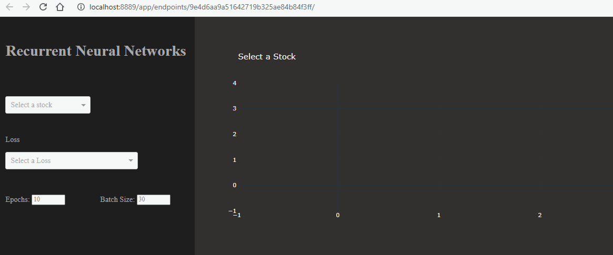

# Stock Predictions with Machine Learning
The first part of this activity is an app that gives users the power to create their own Recurrent Neural Networks models. By simply picking from a drop-down menu, users can choose which SP-500 company they want to analyze and which algorithms they want to analyze it with. The app was designed to translate the hard python code of tensorflow into a visually appealing user interface that anyone can understand.

**Please click the link for raw code:** 
[Recurrent Neural Network Dashboard](https://github.com/EmilianoAmador/Stock_Predictions_with_ML/blob/master/RNN_Dash.ipynb "Click Me")

The second part of this activity focuses on comparing the predictive power of two forecasting models, Recurrent Neural Networks and Random Forest Algorithms. We then used each model to predict the S&P 500, and the price of Gold. After, we compared the results and made conclusions based on each model's performance.

* **This script shows raw code comparing SP500 ETF and Gold prices using Recurrent Neural Networks. We used 20 years of daily price data from AlphaVantage API:** 
[Recurrent Neural Network Raw Code](https://github.com/EmilianoAmador/Stock_Predictions_with_ML/blob/master/RNN_SPY_GLD.ipynb "Click Me")

* **This script shows Random Forest Regression of SP500 and Gold Prices. Along with Classification Report of each Machine learning Model:**
[Random Forest Classifier Raw Code](https://github.com/EmilianoAmador/Stock_Predictions_with_ML/blob/master/trail%20and%20error.ipynb "Click Me")

## Notes 
 Index ETFs used are:
 SPDR S&P 500 ETF, 
 SPDR GOLD ETF

Stress Index used from Office of Financial Research
The OFR FSI is the weighted average level of each variable observed in the market on that day, relative to its history. The index is zero when this average is zero, suggesting that stress is at normal levels. The index is calculated after each U.S. trading day.

APIs:
  Alpha Vantage 
  Yahoo Finance
 
 Models used:
  Random Forest VS Recurrent Neural Network

